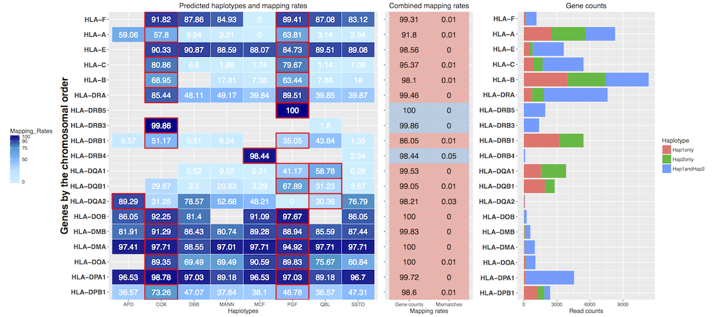

# AltHapAlignR

* More accurate RNA-seq analysis that leverages knowledge of haplotype sequence and structure
* An approach for utilising knowledge of alternate reference haplotypes to generate gene and haplotype level estimates of transcript abundance. 


**Table of contents:**

* [Installation](#installation)
* [Alignment](#alignment)
* [Usage](#usage)
* [Performance ](#performance)
* [Contact](#contact)


## Output of AltHapAlignR

### A graphic overview of haplotype prediction
Synthetic heterozygote data with the PGF and COX (1:1 ratio) haplotypes in the MHC region shown for this figure.




Haplotype prediction and the mapping rates (left panel). These are shown for each classical HLA gene (ordered on the y-axis according to their genomic position) with respect to each of the eight known haplotypes and presented as a heat map. Numbers in each cell are mapping rates. Predicted haplotypes are highlighted with a red border. Empty cells represent genes that are not annotated in the given haplotype. Combined mapping rates from the predicted haplotypes (middle panel). Each mapping rate in the first column is the read counts of the gene in the predicted haplotype(s) divided by the total read count of the gene across all haplotypes. Mismatching mapping rates of predicted haplotypes are in the second column. Pink and grey colors are genes predicted as heterozygous and homozygous respectively. Gene counts (right panel). Bar plots show the raw read counts for each gene.  


## Installation

Before installing 'AltHapAlignR', we need to set up python environment. 

### The python script has a few dependencies:

* [pybam](https://github.com/JohnLonginotto/pybam): "Pure Python" -but
  fast- library to read BAM files. 
```
pip install https://github.com/JohnLonginotto/pybam/zipball/master
```

* [intervaltree](https://pypi.python.org/pypi/intervaltree): "Pure Python"
  library that implements [interval trees](https://en.wikipedia.org/wiki/Interval_tree)
```
pip install intervaltree
```
  
* [quicksect](https://pypi.python.org/pypi/quicksect): C/Python library
  that implements [interval trees](https://en.wikipedia.org/wiki/Interval_tree)
  too but is about 4x faster than `intervaltree`. Note that its
  installation may require [Cython](https://pypi.python.org/pypi/Cython)
  and a compiler (e.g. gcc) setup.
```
pip install cython      # if required
pip install quicksect
```
Only one of the last two is needed, `quicksect` being the preferred
option for performance reasons.

There are several ways of bringing them in, the easiest being with `pip`.

Note that you may want to first setup a [virtualenv](https://virtualenv.pypa.io)
before installing the dependencies, to ensure your environment is clean and
self-contained. For instance:

```sh
# if no virtualenv, 
pip install virtualenv

# Where the files are going to be stored
ALTHAPALIGN_VENV=$PWD/althapalign_virtualenv
# To create a "virtualenv" (only the first time)
virtualenv $ALTHAPALIGN_VENV
# To start using the "virtualenv"
source $ALTHAPALIGN_VENV/bin/activate

# install python modules

# To stop using it, once finished
deactivate
```


### Installing 'AltHapAlignR'

```R

# packages to install for using AltHapAlignR :

install.packages("igraph", "ggplot2", "data.table", "dplyr", "plyr", "grid", "gridExtra", "igraph", "reshape2", "foreach")

source("https://bioconductor.org/biocLite.R")
biocLite( c("rtracklayer") )


# install and load the 'devtools' package
install.packages("devtools")
library(devtools)
devtools::install_github('jknightlab/AltHapAlignR')

```


## Alignment

Any read mapper, like TopHat (Kim et al., 2013) or HISAT2 (Kim et al. 2015), can be used for this purpose, provided that information about the alignment is stored in the standard tags provided by the SAM format specification. 


### 1. Building index reference sequences

Depending on mapper, indexing comments are different. These are examples of indexing reference sequences using bowtie2. 


####  building indexes of genome sequence (PGF haplotype)
`bowtie2-build hg38.genome.fa hg38.genome`
  
####   building indexes of the other haplotypes 
```bash
bowtie2-build hg38.mhc_apd.fa hg38.mhc_apd
bowtie2-build hg38.mhc_cox.fa hg38.mhc_cox
bowtie2-build hg38.mhc_dbb.fa hg38.mhc_dbb
bowtie2-build hg38.mhc_mann.fa hg38.mhc_mann
bowtie2-build hg38.mhc_mcf.fa hg38.mhc_mcf
bowtie2-build hg38.mhc_qbl.fa hg38.mhc_qbl
bowtie2-build hg38.mhc_ssto.fa hg38.mhc_ssto
```


### 2. Mapping reads

A bash script './inst/scripts/mapping2theMHCRef.sh' included in the package 


## Usage


```R
library("AltHapAlignR")

```


#### Inputs

* GTF file that covers all the haplotypes
* BAM files (1 per region). They *must* be sorted by *query name* with
  [Picard](http://broadinstitute.github.io/picard/). *Do not use samtools*
  to sort the files as it [does not follow the lexicographic
  order](https://github.com/samtools/hts-specs/issues/5).


#### Running AltHapAlignR

##### 1. get editing distance from bam files

```R
gtf <- system.file("extdata", "gencode.v21.chr_patch_hapl_HLA.annotation.gtf", package = "AltHapAlignR")
bamDir = system.file("extdata",  package="AltHapAlignR")
bamFiles = list.files(bamDir, pattern="^mapping.*bam$", full=TRUE)


# without virtualenv
EDfromBams(bamFiles, gtf, output_name="ed.txt", r="VARSL-VARS2,C6orf205-MUC21")

# without virtualenv
EDfromBams(bamFiles, gtf, output_name="ed.txt", virtualenv="path/althapalign_virtualenv", r="VARSL-VARS2,C6orf205-MUC21")

```

##### 2. get paired mapping rates

Haplotype names of the MHC in the parameter 'hap_names' shoud be in the same order of column names found in the output from 'EDfromBams'.

```R
ed_table=system.file("extdata", "example_ed_table.txt", package = "AltHapAlignR")
ed_table <- read.table(ed_table, sep="\t", header=TRUE)

paired_mapping_rates <- getMappingRatesFromPairs(ed_table, hap_names=c("apd", "cox", "dbb", "mann", "mcf", "pgf", "qbl", "ssto"), read_length=50)
```

##### 3. get shortest paths

```R

gtf <- system.file("extdata", "gencode.v21.chr_patch_hapl_HLA.annotation.gtf", package = "AltHapAlignR")
paired_mapping_rates=system.file("extdata", "example_paired_mapping_rates.txt", package = "AltHapAlignR")
paired_mapping_rates <- read.table(paired_mapping_rates, sep="\t", header=TRUE)

output <- heatmapByShortestPaths(paired_mapping_rates, gtf, hap_names= c("apd", "cox", "dbb", "mann", "mcf", "pgf", "qbl", "ssto"), penalty=1, sample_name="p1")

```


#### Performance

For obtaining the editing distance from multiple bam files, CPU-time is linear for the total number of reads found in the BAM files. Depending on the CPU, AltHapAlignR can parse between 30,000 and 80,000 reads per second. For over 8 BAM files comprising more than 13 million reads takes less than 3 minutes on an Intel i7-7500U CPU @ 2.70GHz (on 1 core only). The memory consumption is less than 20MB with `quicksect`, 35MB with `intervaltree`, regardless of the number of reads. It only depends on the number of genes and exons in the GTF file. For the rest of calculation, it takes less than 5 min.


### Contact

You are welcome to:

* submit suggestions and bug-reports at: <https://github.com/jknightlab/AltHapAlignR/issues>
* compose a friendly e-mail to: <wl@well.ox.ac.uk>


#### Pleases submit bugs and suggestions

This package is still under development. If you have features you would like to have added, please submit your suggestions and bug-reports at: <https://github.com/jknightlab/AltHapAlignR/issues>
